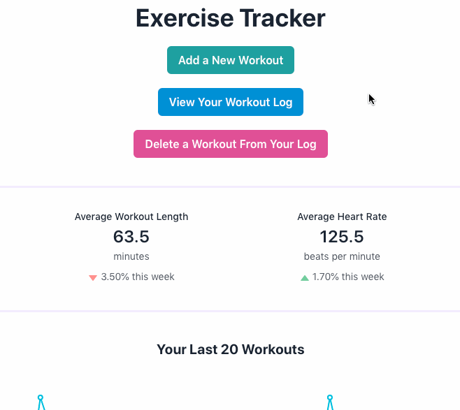
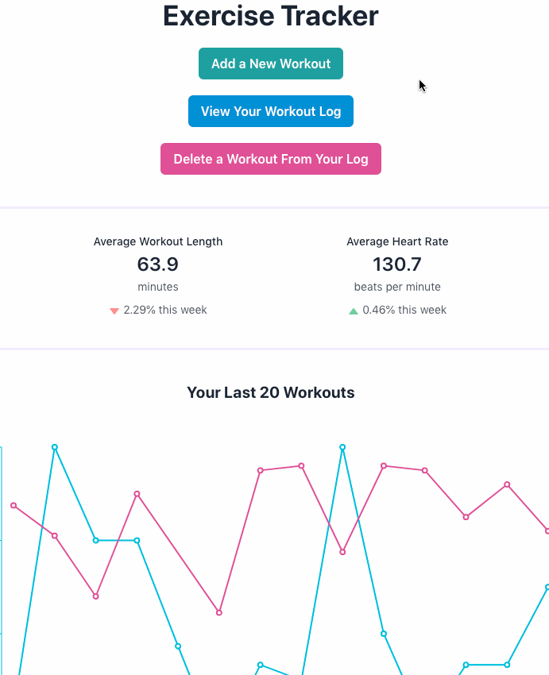
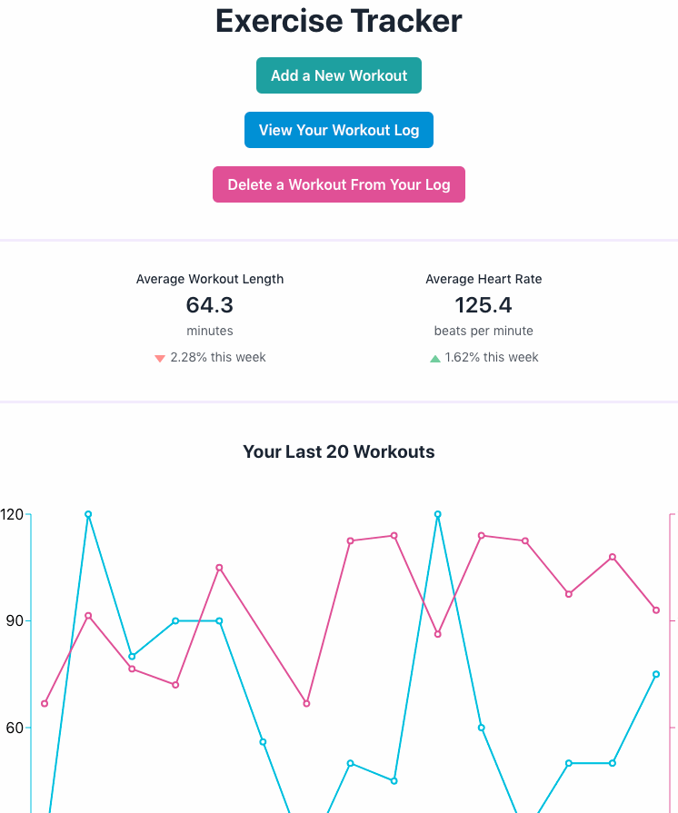
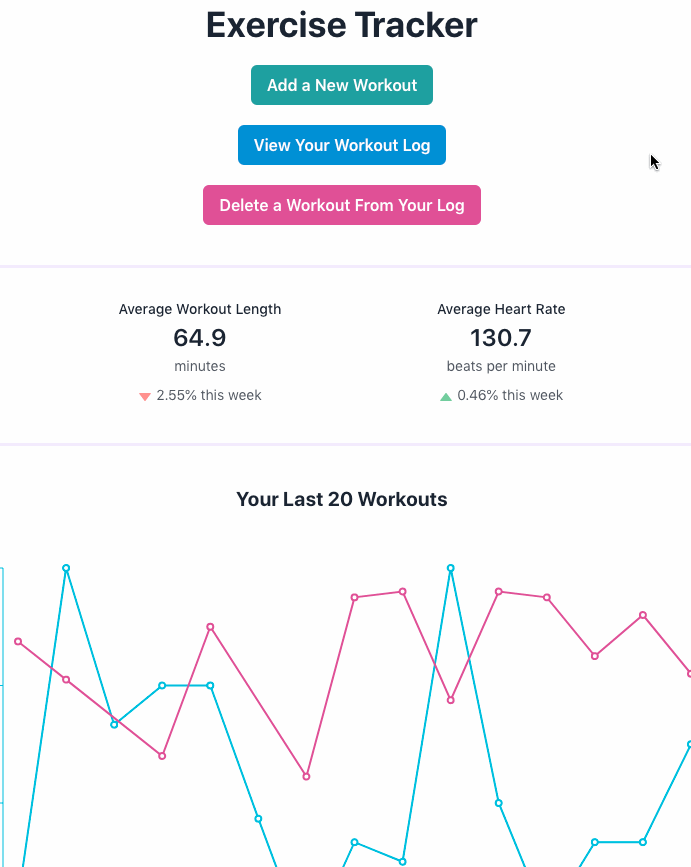
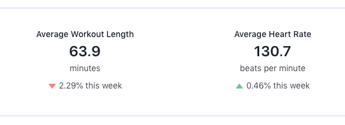
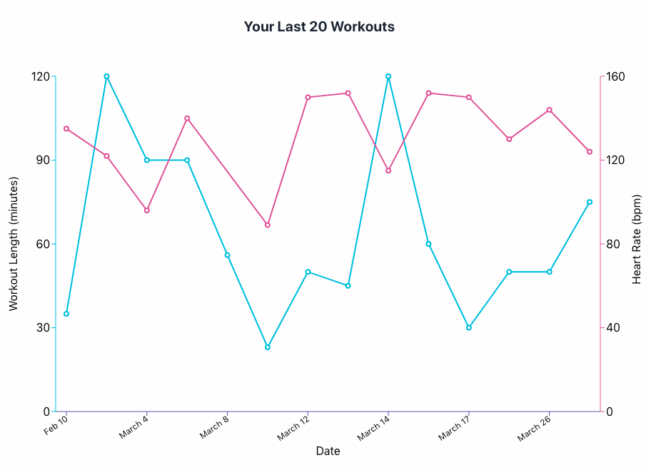
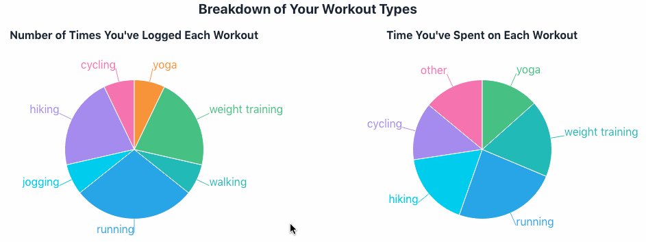

# Exercise Tracker - Front End

This application allows users to track their workouts and view multiple analyses of their data.

## Features
### Add a New Workout

The add a new workout button opens a form in which users can input a new workout.

The Workout Type dropdown is arranged in order of the frequency of use and can be edited by selecting the "edit workout types" option. Users can add their own options and remove any workout type that has not been used in their log.

### View Workout Log
Every workout that has been recorded is shown in the Workout Log sorted by date.

### Delete Workouts
Users can delete any workout they have recorded from their log. 

### Workout Length & Heart Rate Averages
An up-to-date display of the user's average workout length and heart rate are shown along with the percent change for the past seven days. These numbers are immediately adjusted when a workout is added or deleted.

### Last 20 Workouts
The 20 most recent workouts are displayed in a line chart that tracks both workout duration and recorded heart rate. A tooltip details the date, type, length, and heart rate for the workout.

### Breakdown of Workout Types
Two pie charts allow users to visualize the breakdown of the various workout types they have recorded. One chart shows how many times each workout has been logged, while the other shows how much time has been spent performing each workout type.

## Technologies Used
### Front End
- React
- Create React App
- Recharts
- Chakra UI

### Back End
- Node.js
- Express
- SQLite
- Knex.js

---
---

This project was bootstrapped with [Create React App](https://github.com/facebook/create-react-app).

## Available Scripts

In the project directory, you can run:

### `yarn start`

Runs the app in the development mode.\
Open [http://localhost:3000](http://localhost:3000) to view it in the browser.